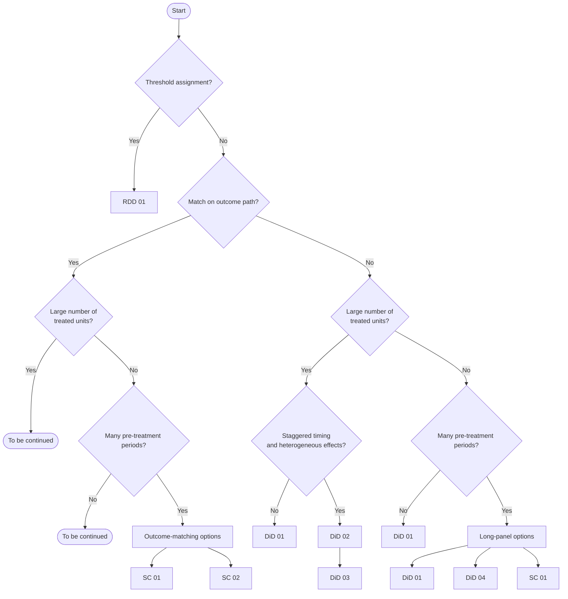

# Quasi-Experimental Methods

Instructional Jupyter notebooks for applied causal inference in marketing settings. Each notebook is self-contained, uses simulated data, and is designed to show when a design is appropriate, what assumptions identify the effect, which diagnostics matter, and how to estimate the model.

## Project Note

This repository is built for learners who prefer to work through methods by doing, not just by reading. That is the main purpose of these notebooks, and it is how I use them myself.

The goal is to give you a practical starting point: enough structure to understand the design, run the analysis, and see the core assumptions and diagnostics in action. Some notebooks simplify parts of the underlying methodology for instructional clarity, so they should be treated as learning tools rather than as fully complete methodological references.

Two important disclaimers:

1. These notebooks are not methodology-complete.
2. This repository is not yet exhaustive, though it is being expanded in that direction.

The collection has been expanding from the framework presented in Li, Luo, and Pattabhiramaiah (2024), ["Causal Inference with Quasi-Experimental Data"](https://www.ama.org/marketing-news/causal-inference-with-quasi-experimental-data/).

## Decision Tree

Use this as a first-pass model picker. It is organized around the identifying feature of the design rather than around software.

| Step | Question | If yes | If no |
| --- | --- | --- | --- |
| 1 | Is treatment assigned, fully or partly, by crossing a fixed threshold in an observed running variable? | [Regression Discontinuity 01](./Regression-Discontinuity/01_vanilla_rdd_marketing.ipynb) | Go to Step 2 |
| 2 | Are you primarily trying to make treated and control units comparable using their pre-treatment outcome path? | Go to Step 3A | Go to Step 3B |
| 3A | Do you have a large number of treated units available? | To be continued | Go to Step 4A |
| 4A | Do you have a sufficiently large number of pre-treatment periods? | [Synthetic Control 01](./Synthetic%20Controls/01_synthetic_control_marketing.ipynb) or [Synthetic Control 02: Bayesian Synthetic Control](./Synthetic%20Controls/02_bayesian_synthetic_control_marketing.ipynb) | To be continued |
| 3B | Do you have a large number of treated units available? | Go to Step 4B | Go to Step 5 |
| 4B | Is treatment staggered over time and are treatment effects likely heterogeneous across cohorts or event time? | [DiD 02: Callaway-Sant'Anna](./Differences-in-Differences/02_multi_period_did_callaway_santanna_marketing.ipynb), then [DiD 03: Sun-Abraham](./Differences-in-Differences/03_multi_period_did_heter_effects_sun_abraham.ipynb) | [DiD 01: Vanilla DiD](./Differences-in-Differences/01_vanilla_did_marketing.ipynb) |
| 5 | Do you have a sufficiently large number of pre-treatment periods? | [DiD 01: Vanilla DiD](./Differences-in-Differences/01_vanilla_did_marketing.ipynb) or [DiD 04: Synthetic DiD](./Differences-in-Differences/04_synthetic_difference_in_differences_arkhangelsky_et_al_marketing.ipynb) | [DiD 01: Vanilla DiD](./Differences-in-Differences/01_vanilla_did_marketing.ipynb) |

## Quick Guide

| If your situation looks like this | Start here | Why |
| --- | --- | --- |
| Treatment turns on at a cutoff or score threshold | [Regression Discontinuity 01](./Regression-Discontinuity/01_vanilla_rdd_marketing.ipynb) | The assignment rule itself creates local comparability near the cutoff. |
| Clean before/after comparison with treated and untreated units, and a standard parallel-trends story is plausible | [DiD 01: Vanilla DiD](./Differences-in-Differences/01_vanilla_did_marketing.ipynb) | This is the baseline panel design and the right first benchmark. |
| Different units adopt treatment in different periods | [DiD 02: Callaway-Sant'Anna](./Differences-in-Differences/02_multi_period_did_callaway_santanna_marketing.ipynb) | This notebook introduces staggered adoption using group-time treatment effects. |
| Staggered adoption plus concern that treatment effects differ across cohorts or event time | [DiD 03: Sun-Abraham](./Differences-in-Differences/03_multi_period_did_heter_effects_sun_abraham.ipynb) | This is the right next step when naive TWFE event studies can be misleading. |
| Long panel, but raw treated and control units do not look comparable without reweighting | [DiD 04: Synthetic DiD](./Differences-in-Differences/04_synthetic_difference_in_differences_arkhangelsky_et_al_marketing.ipynb) | Synthetic DiD combines DiD logic with outcome-based reweighting over units and time. |
| Long pre-treatment panel and matching the full treated outcome path is central | [Synthetic Control 01](./Synthetic%20Controls/01_synthetic_control_marketing.ipynb) | Synthetic control is most natural when pre-treatment fit is the core design feature. |
| Small treated set, long pre-treatment panel, outcome-path matching, and a desire for posterior uncertainty | [Synthetic Control 02: Bayesian Synthetic Control](./Synthetic%20Controls/02_bayesian_synthetic_control_marketing.ipynb) | Bayesian synthetic control keeps the outcome-matching logic but adds flexible coefficients and posterior inference. |

## What The Tree Means

- **Match primarily on the outcome path**: your main strategy is to make treated and control units look alike using their pre-treatment outcome trajectories.
- **Large number of treated units**: enough treated units to make multi-unit DiD comparisons natural rather than relying on a very small treated set.
- **Staggered treatment timing**: different treated units adopt in different periods rather than all at once.
- **Heterogeneous treatment effects**: treatment effects vary across cohorts or over event time, so naive TWFE event studies can be misleading.
- **Sufficiently large number of pre-treatment periods**: enough pre-period observations to check fit, inspect trajectories, and support weighting methods such as synthetic control or synthetic DiD.
- **Fixed threshold assignment**: treatment is determined by whether a running variable crosses a cutoff, making regression discontinuity the natural design before you consider panel-based alternatives.

## Notebook Map

- [Differences-in-Differences/01_vanilla_did_marketing.ipynb](./Differences-in-Differences/01_vanilla_did_marketing.ipynb)
- [Differences-in-Differences/02_multi_period_did_callaway_santanna_marketing.ipynb](./Differences-in-Differences/02_multi_period_did_callaway_santanna_marketing.ipynb)
- [Differences-in-Differences/03_multi_period_did_heter_effects_sun_abraham.ipynb](./Differences-in-Differences/03_multi_period_did_heter_effects_sun_abraham.ipynb)
- [Differences-in-Differences/04_synthetic_difference_in_differences_arkhangelsky_et_al_marketing.ipynb](./Differences-in-Differences/04_synthetic_difference_in_differences_arkhangelsky_et_al_marketing.ipynb)
- [Synthetic Controls/01_synthetic_control_marketing.ipynb](./Synthetic%20Controls/01_synthetic_control_marketing.ipynb)
- [Synthetic Controls/02_bayesian_synthetic_control_marketing.ipynb](./Synthetic%20Controls/02_bayesian_synthetic_control_marketing.ipynb)
- [Regression-Discontinuity/01_vanilla_rdd_marketing.ipynb](./Regression-Discontinuity/01_vanilla_rdd_marketing.ipynb)

## Visual Selector

This visual is intentionally compact. Use the decision table above for the clickable notebook links, and use the diagram below for a quick visual pass.

