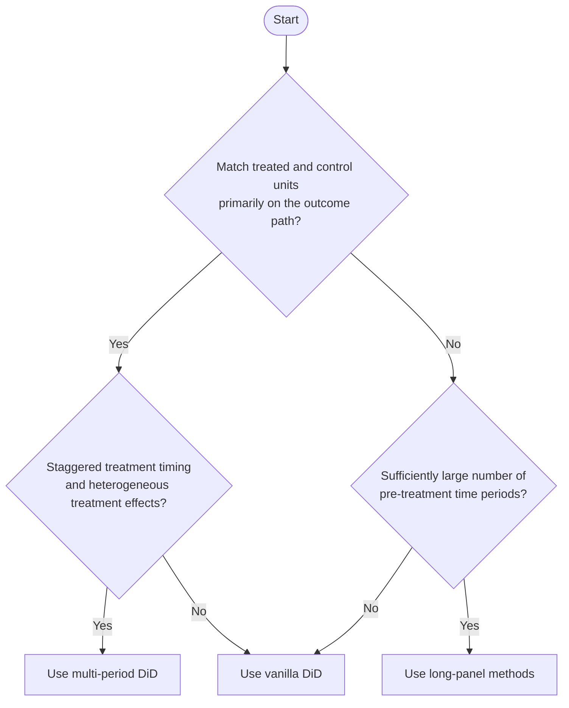

# Quasi-Experimental Methods

Instructional Jupyter notebooks for applied causal inference in marketing settings. Each notebook is self-contained, uses simulated data, and is designed to show when a design is appropriate, what assumptions identify the effect, which diagnostics matter, and how to estimate the model.

## Decision Tree

Use this as a first-pass model picker.

## Recommended Path By Branch

| Decision path | Recommended notebook(s) | Why |
| --- | --- | --- |
| Match treated and control units primarily on the outcome path = **Yes**; staggered timing and heterogeneous effects = **Yes** | Start with [02 Multi-Period DiD: Callaway-Sant'Anna](./Differences-in-Differences/02_multi_period_did_callaway_santanna_marketing.ipynb), then move to [03 Multi-Period DiD With Heterogeneous Effects: Sun-Abraham](./Differences-in-Differences/03_multi_period_did_heter_effects_sun_abraham.ipynb) | Use `02` to learn group-time ATT logic under staggered adoption. Use `03` when you need an event-study framework that is robust to heterogeneous treatment effects over event time. |
| Match treated and control units primarily on the outcome path = **Yes**; staggered timing and heterogeneous effects = **No** | [01 Vanilla DiD](./Differences-in-Differences/01_vanilla_did_marketing.ipynb) | Start with the cleanest 2x2 DiD setup when treatment is simple and standard parallel trends is the main identifying assumption. |
| Match treated and control units primarily on the outcome path = **No**; many pre-treatment periods = **Yes** | [01 Vanilla DiD](./Differences-in-Differences/01_vanilla_did_marketing.ipynb), [04 Synthetic Difference-in-Differences](./Differences-in-Differences/04_synthetic_difference_in_differences_arkhangelsky_et_al_marketing.ipynb), [01 Synthetic Control](./Synthetic%20Controls/01_synthetic_control_marketing.ipynb) | Longer panels let you assess pre-fit and build weighted comparisons. `04` is useful when you want DiD plus outcome-based reweighting. Synthetic control is useful when matching the entire pre-treatment path is central. `01` remains the baseline benchmark. |
| Match treated and control units primarily on the outcome path = **No**; many pre-treatment periods = **No** | [01 Vanilla DiD](./Differences-in-Differences/01_vanilla_did_marketing.ipynb) | If the panel is short, the more weighting-intensive methods are harder to justify and diagnose well. Start with the simplest DiD and be explicit about its limitations. |

## What The Tree Means

- **Match primarily on the outcome path**: your main strategy is to make treated and control units look alike using their pre-treatment outcome trajectories.
- **Staggered treatment timing**: different treated units adopt in different periods rather than all at once.
- **Heterogeneous treatment effects**: treatment effects vary across cohorts or over event time, so naive TWFE event studies can be misleading.
- **Sufficiently large number of pre-treatment periods**: enough pre-period observations to check fit, inspect trajectories, and support weighting methods such as synthetic control or synthetic DiD.

## Notebook Map

- [Differences-in-Differences/01_vanilla_did_marketing.ipynb](./Differences-in-Differences/01_vanilla_did_marketing.ipynb)
- [Differences-in-Differences/02_multi_period_did_callaway_santanna_marketing.ipynb](./Differences-in-Differences/02_multi_period_did_callaway_santanna_marketing.ipynb)
- [Differences-in-Differences/03_multi_period_did_heter_effects_sun_abraham.ipynb](./Differences-in-Differences/03_multi_period_did_heter_effects_sun_abraham.ipynb)
- [Differences-in-Differences/04_synthetic_difference_in_differences_arkhangelsky_et_al_marketing.ipynb](./Differences-in-Differences/04_synthetic_difference_in_differences_arkhangelsky_et_al_marketing.ipynb)
- [Synthetic Controls/01_synthetic_control_marketing.ipynb](./Synthetic%20Controls/01_synthetic_control_marketing.ipynb)
- [Regression-Discontinuity/01_vanilla_rdd_marketing.ipynb](./Regression-Discontinuity/01_vanilla_rdd_marketing.ipynb)
